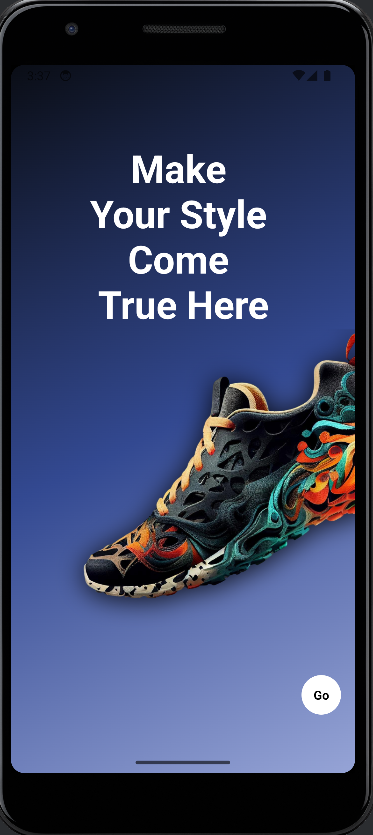

# 🛒 SneakerHub – Shoe Shopping Android App

SneakerHub is a modern and scalable **Android e-commerce application** developed using **Kotlin** and **Jetpack Compose**.  
The app focuses on delivering a clean, intuitive, and responsive shopping experience using **declarative UI principles** and **modern Android development practices**.

---

## 📖 Project Overview

SneakerHub simulates a real-world shoe shopping application where users can browse products, view detailed product information, manage their cart, and review an order summary with automatically calculated pricing.

The project is built entirely with **Jetpack Compose**, eliminating traditional XML layouts and showcasing modern Android UI development using a **single-language (Kotlin-only) approach**.

This project demonstrates:
- Declarative UI development with Jetpack Compose
- Kotlin-only Android app architecture
- Scalable e-commerce workflows
- Clean code structure using MVVM

---

## ✨ Key Features

### 🔹 User Interface
- Modern onboarding experience
- Home screen with featured and recommended shoes
- Product detail screen including:
  - High-quality product images
  - Color selection
  - Size selection
  - Quantity increment/decrement
- Cart and order summary screen
- Clean, minimal, and responsive UI built with Material 3

### 🔹 Shopping & Cart Management
- Add and remove products from cart
- Update product quantities in real time
- Automatic calculation of:
  - Subtotal
  - Delivery charges
  - Tax
  - Total payable amount

---

## 📱 App Screenshots

 
  
  
  

  <b>Onboarding</b> &nbsp;&nbsp;&nbsp;
  <b>Home</b> &nbsp;&nbsp;&nbsp;
  <b>Product</b> &nbsp;&nbsp;&nbsp;
  <b>Cart</b>

---

## 🛠 Technology Stack

### 🔹 Frontend
- **Language:** Kotlin
- **UI Framework:** Jetpack Compose
- **Design System:** Material 3
- **State Management:** State, MutableState, ViewModel

### 🔹 Architecture
- **MVVM (Model–View–ViewModel)**
- Unidirectional data flow
- Clear separation of UI, business logic, and state

### 🔹 Build System
- Gradle
- Kotlin DSL (`.kts`)

---

